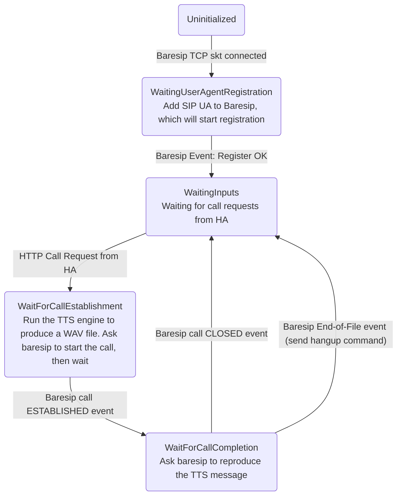

# VOIP Client Development

Make sure you have read the [Home Assistant addon guide](https://developers.home-assistant.io/docs/add-ons)
before digging into an HomeAssistant addon.

This addon is based on a docker image containing:
* baresip software and its configuration files (adapted for the addon)
* a backend written in golang; see the [backend folder](./backend/); the backend is a bridge between the HomeAssistant automations and Baresip

## How it works

The backend operates a simple Finite State Machine. A slightly-simplified representation of the FSM is:

